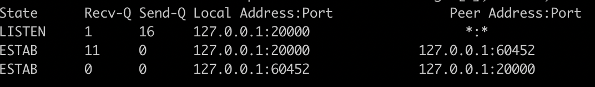

# TCP 소켓이 쓰러지지 않아
> client과 server가 TCP connection을 맺는 각각의 과정에서 실패한다면, 혹은 어떠한 option을 설정하고 있느냐에 따라서 어떻게 동작이 변하는지에 대한 테스트를 진행한 글

* ref
  * https://blog.cloudflare.com/ko/when-tcp-sockets-refuse-to-die-ko/?fbclid=IwAR0Lllgoywj7zQg0tuKLsf0qKIMeVURI2_Wsbn-PpfNRyBJZm0itZ389xPg
  * https://mindnet.tistory.com/entry/네트워크-쉽게-이해하기-22편-TCP-3-WayHandshake-4-WayHandshake

### 내용 정리
* ss: ss is used to dump socket statistics. It allows showing information similar to netstat.  It can display more TCP and state informations than other tools.

netstat 과 유사한 도구. 시스템의 socket들에 대한 통계를 제공한다

netstat, ss 시에 0.0.0.0, *, :: 등으로 IP가 보일때가 있다

해당 포트에 대해서 socket 이 대기하고 있을때 보인다

바인딩되기를 기다리고 있기에 IP가 0.0.0.0 으로 보이는 것이고, IPv6 경우에 :: 으로 보인다

-o 옵션을 붙이면 각 소켓의 timer 정보를 볼 수 있다

timer:(<timer_name>,<expire_time>,<retrans>)
on : means one of these timers: TCP retrans timer, TCP
    early retrans timer and tail loss probe timer
keepalive: tcp keep alive timer
timewait: timewait stage timer
persist: zero window probe timer
unknown: none of the above timers

atexit
프로그램, 모듈이 종료될 때 호출할 함수들을 등록할 수 있다. 최대 32개까지 후입선출 방식으로 등록 가능
exit 함수를 사용하는 경우에는 atexit이 실패할 수 있다

SIGINT signal_interupt
CTRL + C 입력하게 되면 SIGINT 가 프로세스로 전달되어 종료된다. 키보드 입력으로 발생시킨 시그널을 받으면 왜 종료 되는가?
시그널을 받는 프로세스들은 그에 맞는 행동을 취하게 되는데 SIGINT에 대한 구현이 없기에 종료되는 것
Ctrl+C SIGINT 프로세스를 종료시킨다.
Ctrl+Z SIGSTP 프로세스를 중단시킨다.
Ctrl+\ SIGQUIT core dump를 남기고 프로세스를 종료시킨다.

SOCK_STREAM : TCP
SOCK_DGRAM : UDP


client : close -> syn-sent -> established
server : close -> listen -> syn-recv -> established


* SYN-SENT

client에서 syn 패킷을 보내면 syn-sent 상태가 된다
이 상태에서 기본적으로 6번 재시도를 하게 된다
글에서는 5.2 커널에서 TCP_USER_TIMEOUT 이 connect의 동작에 영향을 준다고 하는데
커널 3.10 에서 테스트해보면 영향을 주지 않는다

* SYN_RECV

server에서 syn 패킷을 받으면 syn-recv 상태가 되고 syn-ack 패킷을 보낸다
이때 client 로 들어가는 통로를 iptables로 막아버리면 전달되지 않는다 이때 기본적으로 5번 재시도가 일어난다
64초후에 syn-recv 소켓도 사라진다
TCP_USER_TIMEOUT, SO_KEEP_ALIVE 는 영향을 주지 않는다

* SYN-ACK

client가 syn-ack 을 받으면 server 쪽으로 ack 를 보내는데
이때 서버는 ack 를 받지 못해도 ESTAB 상태가 되어 패킷을 주고 받을 수 있다
실제 데이터가 수신 되기 전까지 ESTAB 가 되지 않고 기다리는 옵션은 TCP_DEFER_ACCEPT
TCP_DEFER_ACCEPT를 켜지 않으면 바로 ESTAB 상태가 되어 계속해서 1초마다 ACK 패킷을 주고 받는다
이 옵션을 켬으로써 불필요한 리소스 낭비, 성능 향상 등을 고려해볼 수 있다

* IDLE

두 소켓이 모두 ESTAB 상태가 되었을때 기본적으로 데이터가 오고가지 않으면 서로의 상태를 알 수가 없다
이때 사용하는 것이 keepalive (HTTP 1.1) 이다

* SO_KEEPALIVE = 1 - 킵얼라이브를 사용
* TCP_KEEPIDLE = 5 - 5초 쉰 뒤에 첫번째 킵얼라이브 탐색 패킷을 보냄
* TCP_KEEPINTVL = 3 - 3초 뒤에 두번째 킵얼라이브 탐색 패킷을 보냄
* TCP_KEEPCNT = 3 - 세번의 탐색 패킷이 실패하면 타임 아웃

클라이언트가 아닌 서버에 설정 해주면 제대로 동작하지 않는다

* KEEPALIVE + TCP_USER_TIMEOUT 같이 쓰기

TCP_USER_TIMEOUT 과 같이 쓰게 되면 KEEPALIVE 설정 중 일부가 덮어써진다
keepalive 패킷을 주고받는 중에 TCP_USER_TIMEOUT 을 넘게되면 즉시 R. 전달되고 종료된다
KEEPCNT 값도 무시된다. 따라서 이 값이 의미 있기 위해서는 TCP_USER_TIMEOUT 은 아래의 값보다 작아야한다
TCP_KEEPIDLE + TCP_KEEPINTVL * TCP_KEEPCNT‌

```
net.ipv4.tcp_retries1 = 3         # 무언가 문제가 있을때 연결의 위해 재시도할 횟수
net.ipv4.tcp_retries2 = 15        # TCP 연결을 끊기전에 재시도할 횟수
net.ipv4.tcp_syn_retries = 6
net.ipv4.tcp_synack_retries = 5
```

* 바쁜 ESTAB 소켓은 영원하지 않다
3way 핸드쉐이킹 이후 모든 패킷을 버리는 방화벽을 설정하고 데이터를 보냈을때의 테스트

c ——X———> s

c -> P. -> s   : 버려짐



Recv-Q 란 소켓이 처리해야할 데이터 중 아직 처리하지 못한 데이터

아직 서버로 전달하지 못했기에 쌓여있는 상태

c <——X—— s

c -> P. -> s 

c <- . <- s : 버려짐

서버로 부터 ACK 못받았기에 클라이언트는 계속 재전송한다

클라이언트의 Recv-Q , 서버의 Send-Q 가 쌓여있는 상태

데이터의 재전송 횟수와 재전송 인터벌이 정해져있기에 사실상 timeout 이 있는 셈이다
tcp_retries2 = 15  기본적으로 15번 재전송 시도를 하게된다

* 0 windows 는 영원할까?

3way 핸드쉐이킹 할때 tcpdump 는 보면 서로 win 이라는 것을 주고 받는 걸 볼 수 있다.
혼잡제어를 위해서 window size 라는 것을 사용하고 수신쪽에 부하가 있다면 window size를 줄여서 송신쪽에서 데이터를 보내지 않도록 0 window 를 줄수도 있다.
window 도 처음부터 다 쓰는 건 아니고 slow start 라고 처음에는 작게 사용하기 시작하고 2배씩 늘려간다.

0 window 를 받게 되면 송신측에서는 윈도우 탐색 패킷을 보내게 됩니다. 기본적으로 15번 보내게 되고 그 후 종료됩니다.

* 어플리케이션의 타임아웃

본 글에서는 어플리케이션에서는 타임아웃으로 연결을 종료했지만 TCP socket 이 남아있는 문제가 있었습니다.
어플리케이션에서 관리하는 타임아웃을 쓸때는 다음을 주의하여야 합니다.

1. TCP 킵얼라이브를 설정. 연결이 유휴 상황에서도 데이터 흐름을 유지하기 위해 필요함.
2. TCP_USER_TIMEOUT을 TCP_KEEPIDLE + TCP_KEEPINTVL * TCP_KEEPCNT 로 설정
3. 어플리케이션이 관리하는 타임아웃을 사용할 때에는 주의할것.

TCP 연결 실패를 알기 위해서는 TCP 킵얼라이브와 사용자 타임아웃을 사용할것.
자원의 여유가 필요하고 소켓이 너무 오래 남아 있기를 바라지 않는다면 소켓이 원하는 전송율로 데이터를 보내고 있는지 주기적으로 검사하는 것을 고려할것. 
ioctl(TIOCOUTQ) 를 이용할 수 있지만, 이 경우 버퍼에 있는 데이터 (미송신)과 전송중 (미승인) 데이터를 모두 포함.
더 나은 방법은 미송신 데이터 크기만을 알려주는 TCP_INFO tcpi_notsent_bytes 인수를 사용하는 것임.

tcpdump 패킷캡쳐와 ss 커맨드를 같이 쓰는 것은 네트워킹 스택을 이해하는데 좋은 방법이다
송신 버퍼의 크기를 확인하는 것과 현재 동작중인 TCP 타이머를 확인하는 것은 소켓이 실제로 살아있는지 확인하기에 좋은 방법
